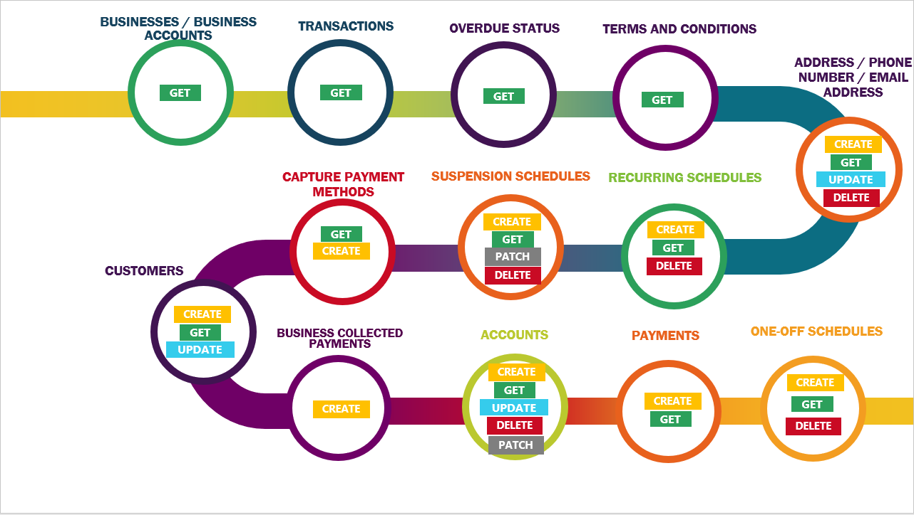

Debitsuccess is building a RESTful API suite as an alternative for the services offered by our SOAP Webservices. So far we have completed the functionalities shown in the below figure:

|  **Quick Links**  | 
|  --- | 
| [[Debitsuccess API Overview|Debitsuccess-API-Overview]] | 

|  **Get Started**  | 
|  --- | 
| <ul><li>[[Authentication|Authentication]]

</li><li>[[HTTP Requests|HTTP-Requests]]

</li><li>[[Response Codes|Response-Codes]]

</li></ul> | 

|  **Widgets**  | 
|  --- | 
| <ul><li>[[Payment Capture Widget|Payment-Capture-Widget]]

</li></ul> | 

|  **Other Resources**  | 
|  --- | 
| <ul><li>[[Release Updates|REST-API-Change-History]]

</li><li>[Reference](https://debitsuccess.atlassian.net/wiki/spaces/DDE/pages/1257414195/Library)

</li><li>[[Glossary|Glossary]]

</li></ul> | 

|  **API Methods**  | 
|  --- | 
| <ul><li>[REST API](https://debitsuccess.atlassian.net/wiki/spaces/DDE/pages/1157791982/Workflows)s 

</li><li>[Full API Reference Guide](https://oc-debitsuccess.portal.azure-api.net/docs/services/Mock/operations/5ddddcd07f477580b89057cd)

</li></ul> | 

*****

